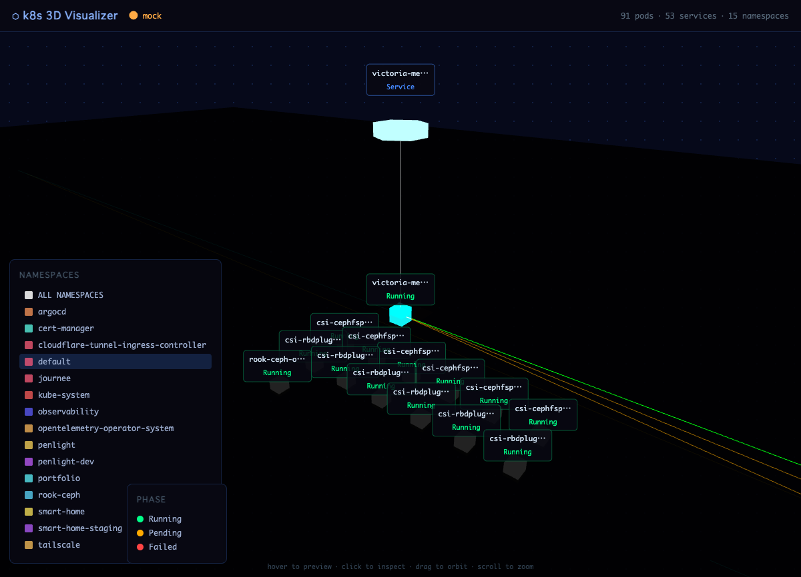

# K8s 3D Network Visualizer

自宅Kubernetesクラスターのネットワーク構成をThree.jsで3D可視化するWebアプリケーション。

Claude Blender Connectorで生成した3Dモデルを活用し、Pod・Node・Serviceの状態をリアルタイムで描画する。

お手持ちのk8sクラスタに配置するだけで自動でクラスタ情報を収集し描画してくれます。

サンプルページはこちら → [https://k8s-visualizer.aooba.net/](https://k8s-visualizer.aooba.net/)



## ドキュメント一覧

| ファイル | 内容 |
|---|---|
| [システム実装仕様書](spec/v1-implementation.md) | 現在のシステム構成・実装詳細・API仕様 |
| [今後の拡張予定](docs/future-roadmap.md) | 将来的な機能拡張案・UI改善・バックログ |
| [アーカイブ](docs/archive/) | 過去の開発手順書・PoC資料 |

## ディレクトリ構成

```
k8s-3d-visualizer/
├── frontend/                # Three.js Webアプリ (Vite)
├── backend/                 # Node.js APIサーバー (Fastify)
├── k8s/                     # Kubernetesマニフェスト (RBAC, Deployment)
├── spec/                    # 実装仕様書
└── docs/                    # ロードマップ・アセット・アーカイブ
```

## 技術スタック

| 役割 | 技術 |
|---|---|
| 3Dモデル生成 | Blender + Claude Blender Connector → GLB |
| フロントエンド | Vite + Three.js |
| バックエンド | Node.js + @kubernetes/client-node |
| リアルタイム通信 | WebSocket |
| デプロイ先 | 自宅k8sクラスター |
