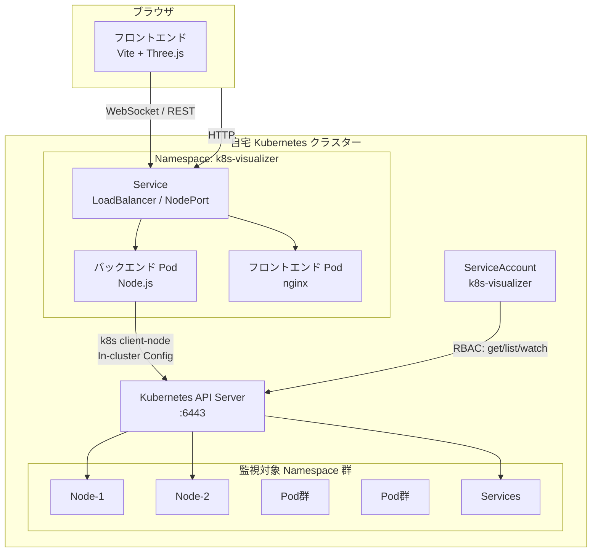
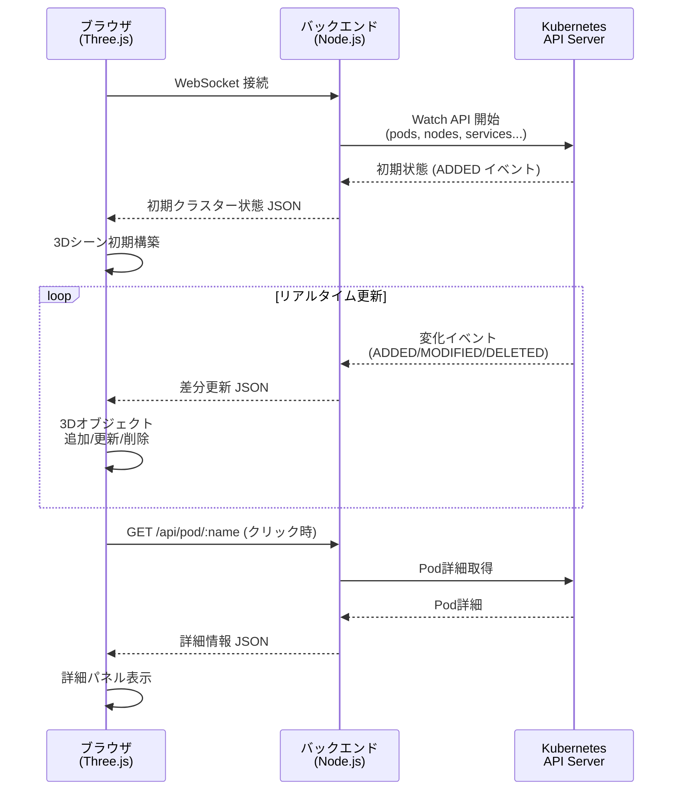
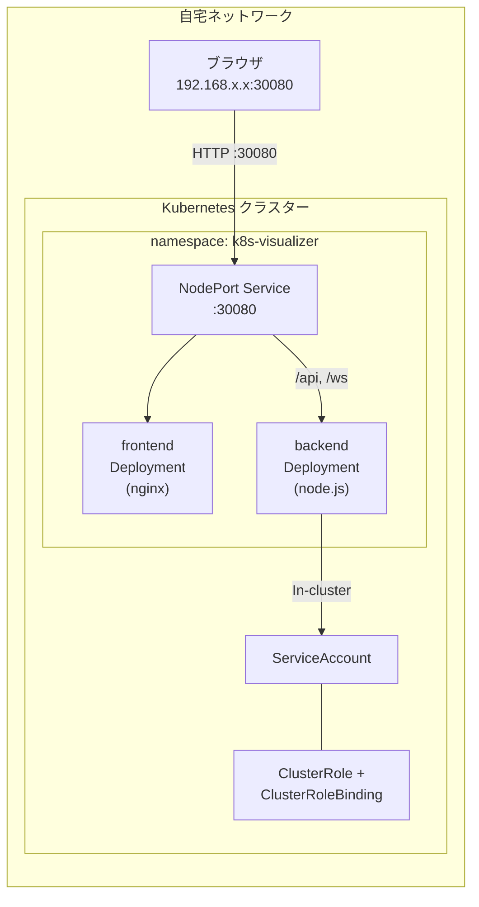
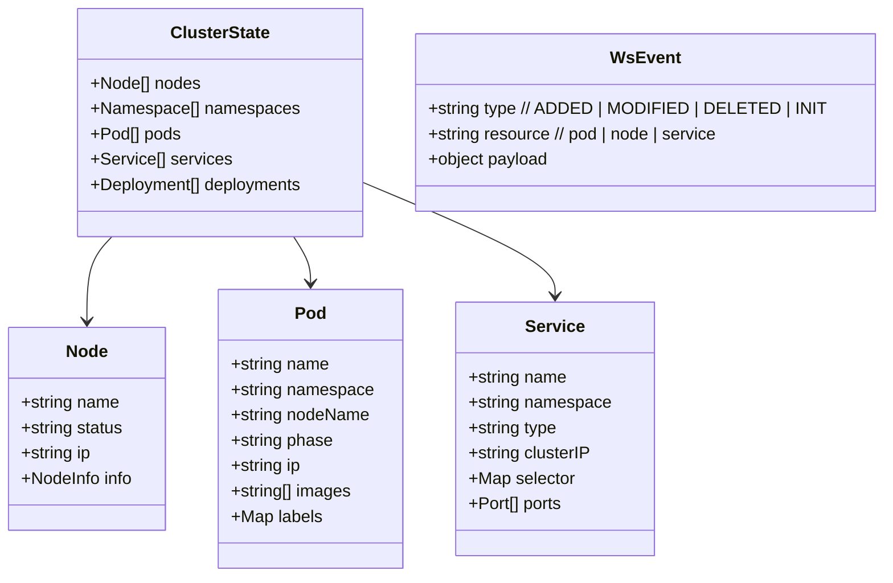
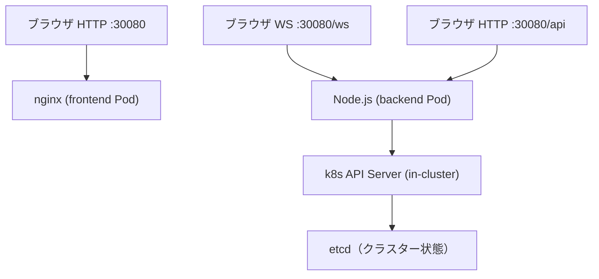

# アーキテクチャ設計書

## システム全体構成

---

## コンポーネント間データフロー

---

## ディプロイメント構成

---

## 技術スタック詳細

### フロントエンド

| 項目 | 技術 | 理由 |
|---|---|---|
| ビルドツール | Vite | 高速HMR、設定シンプル |
| 3Dレンダリング | Three.js | 実績・ドキュメント豊富 |
| 状態管理 | Zustand | 軽量、Three.jsとの相性良 |
| WebSocket | ネイティブ WebSocket API | 外部依存不要 |
| 3Dモデル | GLB (Blender生成) + プロシージャル | Claude Blender Connector活用 |

### バックエンド

| 項目 | 技術 | 理由 |
|---|---|---|
| ランタイム | Node.js (Bun互換) | k8sクライアントライブラリが充実 |
| フレームワーク | Fastify | 軽量・高速 |
| k8sクライアント | @kubernetes/client-node | 公式ライブラリ |
| WebSocket | ws | シンプルで軽量 |

### インフラ

| 項目 | 技術 |
|---|---|
| コンテナ | Docker |
| オーケストレーション | Kubernetes |
| サービス公開 | NodePort（自宅LAN内のみ） |
| 権限管理 | ServiceAccount + ClusterRole（read-only） |

---

## データモデル（フロントエンド受信形式）

---

## ネットワーク接続まとめ

| 接続 | プロトコル | ポート |
|---|---|---|
| ブラウザ → nginx | HTTP | 30080 (NodePort) |
| ブラウザ → backend | WebSocket | 30080/ws (nginxでプロキシ) |
| ブラウザ → backend | REST | 30080/api (nginxでプロキシ) |
| backend → k8s API | HTTPS | 443 (in-cluster) |
