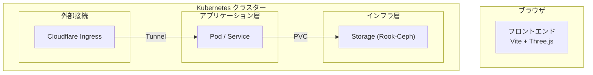

# アーキテクチャ設計書

## システム全体構成

## データフロー

1.  **静的フェーズ (現在)**:
    - `extract-k8s-data.js` が `kubectl` でクラスター情報を取得。
    - 取得した情報を `cluster-state.json` に保存し、フロントエンドが `fetch` して描画。
2.  **動的フェーズ (今後)**:
    - バックエンド (Node.js) が Kubernetes API を Watch。
    - WebSocket を通じて差分情報（ADDED/MODIFIED/DELETED）をブラウザへプッシュ。

## 空間レイヤー定義 (Z-Axis of Logic)

| レイヤー | Y座標 | 主な役割 |
|---|---|---|
| **Ingress** | 10 ~ 12 | 外部流入、ゲートウェイ、ポータルの描画 |
| **Workload** | 0 | アプリケーション本体、サービスの水平接続 |
| **Storage** | -3 | 物理ストレージ基盤、PVCの垂直接続 |

## 主要なデータフラグ

各リソースオブジェクトには、3D空間での役割を決定するためのメタデータが付与される。

- `isStorage`: ストレージ基盤 Pod（地下に移動）
- `isIngress`: 外部接続 Pod（上空に移動）
- `isMonitoring`: 監視スタック Pod（パルス演出の起点）
