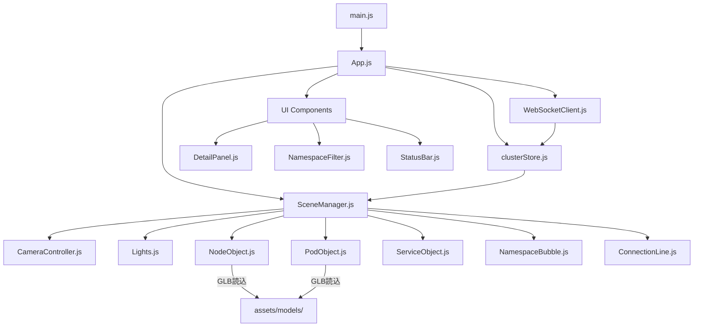
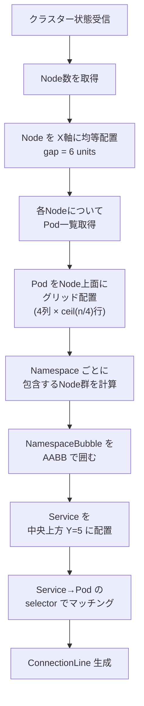
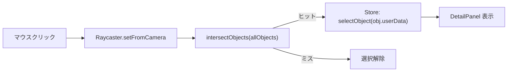

# フロントエンド設計書

## ディレクトリ構成

```
frontend/
├── src/
│   ├── main.js               # エントリーポイント
│   ├── App.js                # アプリルート（Canvas + UI）
│   ├── scene/
│   │   ├── SceneManager.js   # Three.js シーン・カメラ・レンダラー管理
│   │   ├── CameraController.js  # OrbitControls ラッパー
│   │   └── Lights.js         # 環境光・ディレクショナルライト設定
│   ├── objects/
│   │   ├── NodeObject.js     # k8s Node の3D表現
│   │   ├── PodObject.js      # k8s Pod の3D表現
│   │   ├── ServiceObject.js  # k8s Service の3D表現
│   │   ├── NamespaceBubble.js  # Namespace ゾーン
│   │   └── ConnectionLine.js   # Pod↔Service 接続線
│   ├── services/
│   │   ├── WebSocketClient.js  # WS接続・イベント受信
│   │   └── ApiClient.js        # REST API呼び出し
│   ├── store/
│   │   └── clusterStore.js     # Zustand ストア（クラスター状態）
│   ├── ui/
│   │   ├── DetailPanel.js      # 選択オブジェクト詳細パネル
│   │   ├── NamespaceFilter.js  # Namespace フィルター UI
│   │   └── StatusBar.js        # 接続状態・Pod数表示
│   └── assets/
│       ├── models/             # Blender生成GLBファイル
│       │   ├── server-node.glb
│       │   └── pod-cube.glb
│       └── textures/           # 背景・テクスチャ
├── public/
│   └── index.html
├── vite.config.js
└── package.json
```

---

## コンポーネント依存関係



---

## 3Dオブジェクト仕様

### NodeObject（k8s Node）

```
形状: サーバーラック型GLBモデル (server-node.glb)
サイズ: W=4, H=2, D=2 (Three.js単位)
配置: X軸方向に均等配置 (間隔: 6)
色:
  Ready    → 素材そのまま（シルバー）
  NotReady → エミッション赤
子オブジェクト: PodObject を上面にグリッド配置
```

### PodObject（k8s Pod）

```
形状: 小キューブ W=0.4, H=0.4, D=0.4
     または pod-cube.glb (Blender製)
色（MeshStandardMaterial emissive）:
  Running     → #00ff88 (緑)
  Pending     → #ffaa00 (黄)
  Failed      → #ff4444 (赤)
  Terminating → #888888 (グレー)
配置: 親Node上面にグリッド (4列 × n行)
アニメーション: Pending時はゆっくりパルス
```

### ServiceObject（k8s Service）

```
形状: 六角形プリズム（プロシージャル生成）
サイズ: 半径0.6, 高さ0.3
色: #4488ff (青白く発光)
配置: Node群の中央上方に浮遊
接続: 対応Podへ ConnectionLine で結ぶ
```

### NamespaceBubble

```
形状: 透過球 / 透過ボックス
素材: MeshBasicMaterial, transparent: true, opacity: 0.05
色: Namespaceごとにハッシュから自動生成
ラベル: Sprite (テクスチャ文字) で名前表示
```

### ConnectionLine（Pod ↔ Service 接続）

```
形状: THREE.Line または TubeGeometry
色: #ffffff, opacity: 0.3
アニメーション: パーティクル（小さな球）が線上を流れる
  - 速度: 1.0 units/sec
  - 間隔: 0.5 sec
```

---

## シーンレイアウトアルゴリズム



---

## カメラ・インタラクション

### OrbitControls 設定

```js
controls.enableDamping = true;
controls.dampingFactor = 0.05;
controls.minDistance = 3;
controls.maxDistance = 50;
controls.target.set(0, 2, 0);  // シーン中心を向く
```

### Raycasting（クリック検出）



### キーボードショートカット

| キー | 動作 |
|---|---|
| `R` | カメラリセット |
| `F` | 選択オブジェクトにフォーカス |
| `Esc` | 選択解除・パネル閉じる |

---

## WebSocket プロトコル

### 受信メッセージ形式

```json
// 初期化（接続直後）
{
  "type": "INIT",
  "payload": {
    "nodes": [...],
    "pods": [...],
    "services": [...],
    "namespaces": [...]
  }
}

// 差分更新
{
  "type": "ADDED" | "MODIFIED" | "DELETED",
  "resource": "pod" | "node" | "service",
  "payload": { ...リソース情報 }
}
```

### 接続管理

```js
// 切断時は自動再接続（3秒後）
ws.onclose = () => setTimeout(connect, 3000);
```

---

## パフォーマンス考慮

| 対策 | 内容 |
|---|---|
| InstancedMesh | Pod数が多い場合、同形状をまとめてインスタンスレンダリング |
| LOD | 遠距離のNodeはシンプルなBoxに切り替え |
| Frustum Culling | Three.js デフォルトで有効（変更不要） |
| アニメーション | requestAnimationFrame ループは60fps上限 |

---

## 状態管理（Zustand Store）

```js
// clusterStore.js のシェイプ
{
  nodes: Map<name, NodeData>,
  pods: Map<name, PodData>,
  services: Map<name, ServiceData>,
  namespaces: string[],
  selectedObject: null | { type, name, data },
  activeNamespaces: Set<string>,   // フィルター用

  // Actions
  initCluster: (payload) => void,
  applyEvent: (event) => void,
  selectObject: (obj) => void,
  toggleNamespace: (ns) => void,
}
```

---

## package.json（主要依存）

```json
{
  "dependencies": {
    "three": "^0.167.0",
    "zustand": "^4.5.0"
  },
  "devDependencies": {
    "vite": "^5.0.0"
  }
}
```
