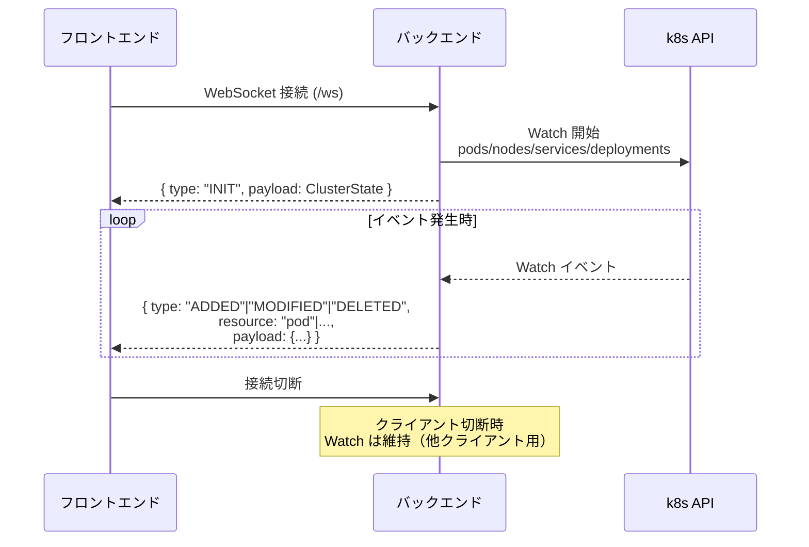
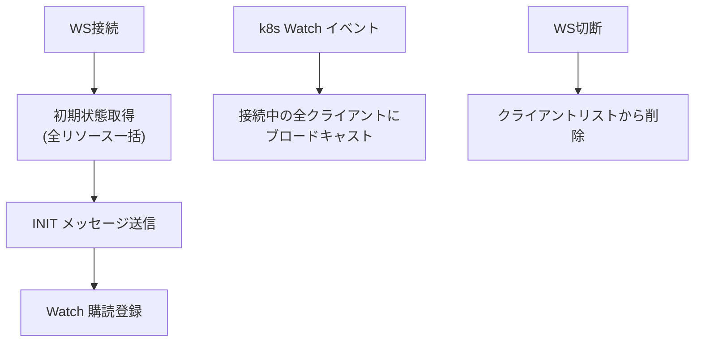

# バックエンド設計書

## 概要

Node.js (Fastify) による APIサーバー。Kubernetes API Server に接続し、クラスター状態をREST APIおよびWebSocketでフロントエンドに提供する。

---

## ディレクトリ構成

```
backend/
├── src/
│   ├── index.js              # エントリーポイント
│   ├── k8s/
│   │   ├── client.js         # k8sクライアント初期化
│   │   ├── watcher.js        # Watch API ラッパー
│   │   └── resources.js      # リソース取得関数群
│   ├── routes/
│   │   ├── cluster.js        # GET /api/cluster (初期状態一括取得)
│   │   └── resources.js      # GET /api/pod/:ns/:name など詳細取得
│   └── ws/
│       └── handler.js        # WebSocket 接続ハンドラ
├── Dockerfile
└── package.json
```

---

## REST API 仕様

### GET /api/cluster

クラスター全体の初期状態を返す（初期ロード用）。

**Response:**
```json
{
  "nodes": [
    {
      "name": "node-1",
      "status": "Ready",
      "ip": "192.168.1.10",
      "cpu": "4",
      "memory": "8Gi",
      "labels": { "kubernetes.io/role": "worker" }
    }
  ],
  "namespaces": ["default", "kube-system", "production"],
  "pods": [
    {
      "name": "api-server-abc12",
      "namespace": "production",
      "nodeName": "node-1",
      "phase": "Running",
      "ip": "10.244.1.5",
      "images": ["nginx:1.25"],
      "labels": { "app": "api" },
      "createdAt": "2026-04-01T00:00:00Z"
    }
  ],
  "services": [
    {
      "name": "api-service",
      "namespace": "production",
      "type": "ClusterIP",
      "clusterIP": "10.96.0.10",
      "selector": { "app": "api" },
      "ports": [{ "port": 80, "targetPort": 8080 }]
    }
  ],
  "deployments": [
    {
      "name": "api-deployment",
      "namespace": "production",
      "replicas": 2,
      "readyReplicas": 2,
      "selector": { "app": "api" }
    }
  ]
}
```

---

### GET /api/pod/:namespace/:name

Pod詳細取得（クリック時）。

**Response:**
```json
{
  "name": "api-server-abc12",
  "namespace": "production",
  "nodeName": "node-1",
  "phase": "Running",
  "ip": "10.244.1.5",
  "images": ["nginx:1.25"],
  "labels": { "app": "api" },
  "annotations": {},
  "conditions": [
    { "type": "Ready", "status": "True" }
  ],
  "containerStatuses": [
    {
      "name": "nginx",
      "ready": true,
      "restartCount": 0,
      "image": "nginx:1.25"
    }
  ],
  "createdAt": "2026-04-01T00:00:00Z"
}
```

---

### GET /api/node/:name

Node詳細取得。

**Response:**
```json
{
  "name": "node-1",
  "status": "Ready",
  "ip": "192.168.1.10",
  "cpu": "4",
  "memory": "8Gi",
  "kubeletVersion": "v1.29.0",
  "os": "linux",
  "arch": "amd64",
  "labels": {},
  "conditions": []
}
```

---

### GET /health

ヘルスチェック用。

**Response:** `{ "status": "ok" }`

---

## WebSocket 仕様

### エンドポイント

`ws://backend:3001/ws`

### 接続フロー



### 送信メッセージ形式

```typescript
// 初期化
{
  type: "INIT",
  payload: ClusterState  // /api/cluster と同じ形式
}

// 差分イベント
{
  type: "ADDED" | "MODIFIED" | "DELETED",
  resource: "pod" | "node" | "service" | "deployment",
  payload: PodData | NodeData | ServiceData | DeploymentData
}

// エラー
{
  type: "ERROR",
  message: string
}
```

---

## k8sクライアント設計

### 接続方式

クラスター内（Pod内）から動作する場合は **In-cluster Config** を使用。

```js
// src/k8s/client.js
import k8s from '@kubernetes/client-node';

const kc = new k8s.KubeConfig();

if (process.env.KUBERNETES_SERVICE_HOST) {
  // クラスター内実行: ServiceAccount の token/cert を自動使用
  kc.loadFromCluster();
} else {
  // ローカル開発: ~/.kube/config を使用
  kc.loadFromDefault();
}

export const coreV1Api = kc.makeApiClient(k8s.CoreV1Api);
export const appsV1Api = kc.makeApiClient(k8s.AppsV1Api);
export const watch = new k8s.Watch(kc);
```

### Watch API（リアルタイム監視）

```js
// src/k8s/watcher.js
export async function watchResource(resourcePath, callback) {
  const req = await watch.watch(
    resourcePath,           // 例: '/api/v1/pods'
    {},
    (phase, obj) => {       // phase: ADDED | MODIFIED | DELETED
      callback(phase, obj);
    },
    (err) => {
      if (err) console.error('Watch error:', err);
      // エラー時は再接続
      setTimeout(() => watchResource(resourcePath, callback), 5000);
    }
  );
  return req;
}
```

### 監視対象リソース

| リソース | APIパス |
|---|---|
| Pod | `/api/v1/pods` |
| Node | `/api/v1/nodes` |
| Service | `/api/v1/services` |
| Namespace | `/api/v1/namespaces` |
| Deployment | `/apis/apps/v1/deployments` |

---

## WebSocket ハンドラ設計



```js
// src/ws/handler.js の骨格
const clients = new Set();

fastify.get('/ws', { websocket: true }, (socket) => {
  clients.add(socket);

  // 初期状態送信
  getClusterState().then(state => {
    socket.send(JSON.stringify({ type: 'INIT', payload: state }));
  });

  socket.on('close', () => clients.delete(socket));
});

// Watch イベントをブロードキャスト
function broadcast(event) {
  const msg = JSON.stringify(event);
  clients.forEach(c => c.readyState === 1 && c.send(msg));
}
```

---

## 環境変数

| 変数名 | デフォルト | 説明 |
|---|---|---|
| `PORT` | `3001` | サーバーポート |
| `CORS_ORIGIN` | `*` | CORS許可オリジン |
| `LOG_LEVEL` | `info` | ログレベル |

---

## Dockerfile

```dockerfile
FROM node:20-alpine
WORKDIR /app
COPY package*.json ./
RUN npm ci --only=production
COPY src/ ./src/
EXPOSE 3001
CMD ["node", "src/index.js"]
```

---

## package.json（主要依存）

```json
{
  "dependencies": {
    "fastify": "^4.28.0",
    "@fastify/websocket": "^10.0.0",
    "@fastify/cors": "^9.0.0",
    "@kubernetes/client-node": "^0.21.0"
  }
}
```
