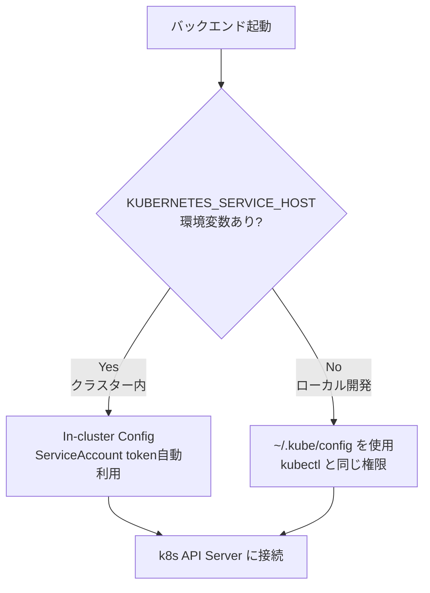

# k8sクラスタ接続ガイド

## 概要

バックエンドPodがKubernetes API Serverに接続し、クラスター情報を取得するための設定手順。
**In-cluster Config** を使用するため、ServiceAccountとRBACの設定が必要。

---

## 接続方式の選択



---

## 1. Namespace 作成

```yaml
# k8s/namespace.yaml
apiVersion: v1
kind: Namespace
metadata:
  name: k8s-visualizer
```

```bash
kubectl apply -f k8s/namespace.yaml
```

---

## 2. ServiceAccount 作成

```yaml
# k8s/serviceaccount.yaml
apiVersion: v1
kind: ServiceAccount
metadata:
  name: k8s-visualizer
  namespace: k8s-visualizer
```

```bash
kubectl apply -f k8s/serviceaccount.yaml
```

---

## 3. RBAC 設定（読み取り専用）

アプリケーションはクラスター全体を**読み取るだけ**なので ClusterRole を使用。

```yaml
# k8s/rbac.yaml
apiVersion: rbac.authorization.k8s.io/v1
kind: ClusterRole
metadata:
  name: k8s-visualizer-reader
rules:
  - apiGroups: [""]
    resources:
      - nodes
      - pods
      - services
      - namespaces
      - endpoints
    verbs: ["get", "list", "watch"]
  - apiGroups: ["apps"]
    resources:
      - deployments
      - replicasets
      - daemonsets
      - statefulsets
    verbs: ["get", "list", "watch"]
---
apiVersion: rbac.authorization.k8s.io/v1
kind: ClusterRoleBinding
metadata:
  name: k8s-visualizer-reader-binding
subjects:
  - kind: ServiceAccount
    name: k8s-visualizer
    namespace: k8s-visualizer
roleRef:
  kind: ClusterRole
  name: k8s-visualizer-reader
  apiGroup: rbac.authorization.k8s.io
```

```bash
kubectl apply -f k8s/rbac.yaml
```

---

## 4. 設定確認

```bash
# ServiceAccount が作成されたか確認
kubectl get serviceaccount k8s-visualizer -n k8s-visualizer

# ClusterRoleBinding が正しく設定されたか確認
kubectl get clusterrolebinding k8s-visualizer-reader-binding

# 権限テスト（ドライラン）
kubectl auth can-i list pods --as=system:serviceaccount:k8s-visualizer:k8s-visualizer
# → yes が返ればOK

kubectl auth can-i list nodes --as=system:serviceaccount:k8s-visualizer:k8s-visualizer
# → yes が返ればOK
```

---

## 5. In-cluster Config の仕組み

Podがクラスター内で動くと、以下のファイルが自動でマウントされる。
`@kubernetes/client-node` の `loadFromCluster()` はこれを自動利用する。

```
/var/run/secrets/kubernetes.io/serviceaccount/
├── token        # Bearer トークン（API認証に使用）
├── ca.crt       # APIサーバーのCA証明書
└── namespace    # このPodのNamespace名
```

また、以下の環境変数も自動注入される：

| 環境変数 | 値の例 |
|---|---|
| `KUBERNETES_SERVICE_HOST` | `10.96.0.1` |
| `KUBERNETES_SERVICE_PORT` | `443` |

---

## ローカル開発時の接続（kubeconfig利用）

自宅k8sクラスターに接続できる `~/.kube/config` があれば、ローカルでも動作確認できる。

```bash
# 現在の接続先確認
kubectl config current-context

# 接続テスト
kubectl get nodes
```

コード側では自動で切り替わる：

```js
if (process.env.KUBERNETES_SERVICE_HOST) {
  kc.loadFromCluster();  // クラスター内
} else {
  kc.loadFromDefault();  // ローカル (~/.kube/config)
}
```

---

## Deployment への ServiceAccount 指定

```yaml
# k8s/backend-deployment.yaml （抜粋）
spec:
  template:
    spec:
      serviceAccountName: k8s-visualizer  # ← これが重要
      containers:
        - name: backend
          image: k8s-visualizer-backend:latest
```

`serviceAccountName` を指定することで、そのPodに対応するServiceAccountのtokenが自動マウントされる。

---

## トラブルシューティング

### 権限エラーが出る場合

```bash
# ログ確認
kubectl logs -n k8s-visualizer deployment/backend

# 権限再確認
kubectl auth can-i list pods \
  --as=system:serviceaccount:k8s-visualizer:k8s-visualizer \
  --all-namespaces
```

### APIサーバーに接続できない場合

```bash
# Pod内から確認（デバッグコンテナ）
kubectl exec -it -n k8s-visualizer <pod-name> -- sh

# Pod内でAPIサーバーへ疎通確認
curl -k https://$KUBERNETES_SERVICE_HOST:$KUBERNETES_SERVICE_PORT/healthz
```

### Watch APIが切れる場合

k8s Watch APIはデフォルト5分でタイムアウトする。
`watcher.js` で自動再接続を実装済み（エラー時5秒後に再試行）。

---

## 権限一覧まとめ

| リソース | get | list | watch |
|---|:---:|:---:|:---:|
| nodes | ✅ | ✅ | ✅ |
| pods | ✅ | ✅ | ✅ |
| services | ✅ | ✅ | ✅ |
| namespaces | ✅ | ✅ | ✅ |
| endpoints | ✅ | ✅ | ✅ |
| deployments | ✅ | ✅ | ✅ |
| replicasets | ✅ | ✅ | ✅ |
| **それ以外** | ❌ | ❌ | ❌ |

読み取り専用のため、クラスターへの書き込みは一切行わない。
