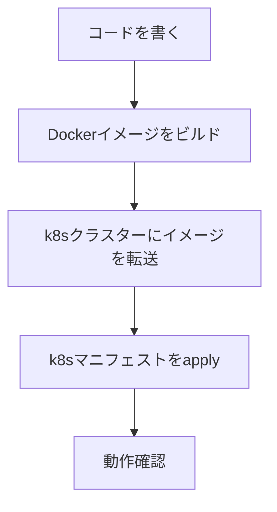

# デプロイ手順書

## 全体フロー



---

## ディレクトリ構成（k8s/）

```
k8s/
├── namespace.yaml
├── serviceaccount.yaml
├── rbac.yaml
├── backend-deployment.yaml
├── backend-service.yaml
├── frontend-deployment.yaml
├── frontend-service.yaml
└── ingress.yaml             # オプション（nginx ingress使う場合）
```

---

## マニフェスト全文

### backend-deployment.yaml

```yaml
apiVersion: apps/v1
kind: Deployment
metadata:
  name: backend
  namespace: k8s-visualizer
spec:
  replicas: 1
  selector:
    matchLabels:
      app: backend
  template:
    metadata:
      labels:
        app: backend
    spec:
      serviceAccountName: k8s-visualizer
      containers:
        - name: backend
          image: k8s-visualizer-backend:latest
          imagePullPolicy: Never        # ローカルイメージ使用
          ports:
            - containerPort: 3001
          env:
            - name: PORT
              value: "3001"
            - name: LOG_LEVEL
              value: "info"
          resources:
            requests:
              cpu: "100m"
              memory: "128Mi"
            limits:
              cpu: "500m"
              memory: "256Mi"
```

### backend-service.yaml

```yaml
apiVersion: v1
kind: Service
metadata:
  name: backend
  namespace: k8s-visualizer
spec:
  selector:
    app: backend
  ports:
    - port: 3001
      targetPort: 3001
```

### frontend-deployment.yaml

```yaml
apiVersion: apps/v1
kind: Deployment
metadata:
  name: frontend
  namespace: k8s-visualizer
spec:
  replicas: 1
  selector:
    matchLabels:
      app: frontend
  template:
    metadata:
      labels:
        app: frontend
    spec:
      containers:
        - name: frontend
          image: k8s-visualizer-frontend:latest
          imagePullPolicy: Never
          ports:
            - containerPort: 80
          resources:
            requests:
              cpu: "50m"
              memory: "64Mi"
            limits:
              cpu: "200m"
              memory: "128Mi"
```

### frontend-service.yaml（NodePort で外部公開）

```yaml
apiVersion: v1
kind: Service
metadata:
  name: frontend
  namespace: k8s-visualizer
spec:
  type: NodePort
  selector:
    app: frontend
  ports:
    - port: 80
      targetPort: 80
      nodePort: 30080      # ブラウザで http://NodeIP:30080 でアクセス
```

---

### nginx.conf（フロントエンドコンテナ用）

フロントエンドのnginxは `/api` と `/ws` をバックエンドへプロキシする。

```nginx
# frontend/nginx.conf
server {
    listen 80;
    root /usr/share/nginx/html;
    index index.html;

    # SPA用（React Router等は不使用だが念のため）
    location / {
        try_files $uri $uri/ /index.html;
    }

    # バックエンドAPIをプロキシ
    location /api {
        proxy_pass http://backend:3001;
        proxy_http_version 1.1;
    }

    # WebSocketをプロキシ
    location /ws {
        proxy_pass http://backend:3001;
        proxy_http_version 1.1;
        proxy_set_header Upgrade $http_upgrade;
        proxy_set_header Connection "upgrade";
    }
}
```

---

## Dockerfile 群

### frontend/Dockerfile

```dockerfile
# ビルドステージ
FROM node:20-alpine AS builder
WORKDIR /app
COPY package*.json ./
RUN npm ci
COPY . .
RUN npm run build

# 本番ステージ
FROM nginx:alpine
COPY --from=builder /app/dist /usr/share/nginx/html
COPY nginx.conf /etc/nginx/conf.d/default.conf
EXPOSE 80
```

### backend/Dockerfile

```dockerfile
FROM node:20-alpine
WORKDIR /app
COPY package*.json ./
RUN npm ci --only=production
COPY src/ ./src/
EXPOSE 3001
CMD ["node", "src/index.js"]
```

---

## デプロイ手順（ステップバイステップ）

### Step 1: Dockerイメージのビルド

```bash
# バックエンド
docker build -t k8s-visualizer-backend:latest ./backend

# フロントエンド
docker build -t k8s-visualizer-frontend:latest ./frontend
```

### Step 2: イメージをクラスターに転送

自宅k8sがどの構成かによって方法が異なる：

#### Kindを使っている場合

```bash
kind load docker-image k8s-visualizer-backend:latest
kind load docker-image k8s-visualizer-frontend:latest
```

#### kubeadm / k3s（シングルノード or masterで動かす場合）

```bash
# イメージをtarにして転送
docker save k8s-visualizer-backend:latest | ssh user@node1 'docker load'
docker save k8s-visualizer-frontend:latest | ssh user@node1 'docker load'
```

#### k3s（containerd利用の場合）

```bash
docker save k8s-visualizer-backend:latest -o backend.tar
k3s ctr images import backend.tar

docker save k8s-visualizer-frontend:latest -o frontend.tar
k3s ctr images import frontend.tar
```

#### プライベートレジストリがある場合（推奨）

```bash
# レジストリにpush
docker tag k8s-visualizer-backend:latest registry.local/k8s-visualizer-backend:latest
docker push registry.local/k8s-visualizer-backend:latest

# manifest の image を変更してapply
```

### Step 3: k8sリソースを作成

```bash
# 順番通りに apply
kubectl apply -f k8s/namespace.yaml
kubectl apply -f k8s/serviceaccount.yaml
kubectl apply -f k8s/rbac.yaml
kubectl apply -f k8s/backend-deployment.yaml
kubectl apply -f k8s/backend-service.yaml
kubectl apply -f k8s/frontend-deployment.yaml
kubectl apply -f k8s/frontend-service.yaml
```

または一括で：

```bash
kubectl apply -f k8s/
```

### Step 4: 動作確認

```bash
# Pod が Running になるまで待つ
kubectl get pods -n k8s-visualizer -w

# ログ確認
kubectl logs -n k8s-visualizer deployment/backend
kubectl logs -n k8s-visualizer deployment/frontend

# NodeIPを確認
kubectl get nodes -o wide
```

ブラウザで `http://<NodeIP>:30080` にアクセス。

---

## 更新デプロイ手順

コードを修正した場合：

```bash
# イメージ再ビルド（タグにバージョンつけると確実）
docker build -t k8s-visualizer-backend:v2 ./backend

# クラスターに転送（Step 2と同様）

# Deploymentのイメージを更新
kubectl set image deployment/backend \
  backend=k8s-visualizer-backend:v2 \
  -n k8s-visualizer

# ロールアウト確認
kubectl rollout status deployment/backend -n k8s-visualizer
```

---

## 削除・クリーンアップ

```bash
# namespace ごと削除（全リソースが消える）
kubectl delete namespace k8s-visualizer

# ClusterRole/Binding は namespace に属さないため別途削除
kubectl delete clusterrole k8s-visualizer-reader
kubectl delete clusterrolebinding k8s-visualizer-reader-binding
```
