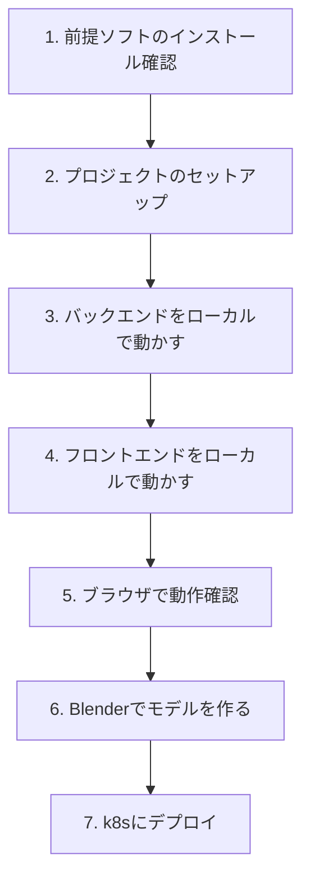
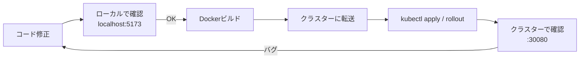

# 開発手順書（初心者向け）

## このドキュメントについて

「環境構築から動作確認まで」を順を追って説明する。初めてNode.js + Three.js + k8sを触る人向け。

---

## 全体の流れ



---

## 1. 前提ソフトのインストール確認

```bash
# Node.js（v20以上）
node --version   # v20.x.x が出ればOK

# npm
npm --version

# Docker
docker --version

# kubectl（自宅k8sクラスターに接続できること）
kubectl version --client
kubectl get nodes    # クラスターのノードが表示されればOK
```

### インストール方法（macOS）

```bash
# Node.js は nvm 経由が楽
curl -o- https://raw.githubusercontent.com/nvm-sh/nvm/v0.39.7/install.sh | bash
nvm install 20
nvm use 20

# Docker Desktop を公式からダウンロードしてインストール

# kubectl
brew install kubectl
```

---

## 2. プロジェクトのセットアップ

```bash
# プロジェクトルートに移動
cd k8s-3d-visualizer

# バックエンド依存インストール
cd backend
npm install

# フロントエンド依存インストール
cd ../frontend
npm install
```

---

## 3. バックエンドをローカルで動かす

ローカルでは `~/.kube/config` を使ってk8sクラスターに接続する。

```bash
cd backend

# 環境変数ファイルを作成
cat > .env << 'EOF'
PORT=3001
LOG_LEVEL=info
EOF

# 起動
npm run dev
```

### 確認

```bash
# 別ターミナルで
curl http://localhost:3001/health
# → {"status":"ok"}

curl http://localhost:3001/api/cluster
# → クラスター情報のJSON（Nodeや Pod一覧）
```

---

## 4. フロントエンドをローカルで動かす

```bash
cd frontend

# 起動（Vite の開発サーバー）
npm run dev
```

Viteが起動したら表示されるURL（通常 `http://localhost:5173`）を開く。

### ローカル開発時のAPI接続設定

フロントエンドがバックエンドに接続するための設定（`vite.config.js`）：

```js
// frontend/vite.config.js
import { defineConfig } from 'vite';

export default defineConfig({
  server: {
    proxy: {
      '/api': 'http://localhost:3001',
      '/ws': {
        target: 'ws://localhost:3001',
        ws: true,
      },
    },
  },
});
```

この設定により、ローカル開発中に `/api/*` や `/ws` へのリクエストが自動的にバックエンド（:3001）に転送される。

---

## 5. ブラウザで動作確認

1. `http://localhost:5173` を開く
2. Three.jsの3Dシーンが表示される
3. k8sクラスターのNode・Pod・Serviceが3D描画される
4. マウスでドラッグ（回転）、スクロール（ズーム）ができる
5. Podをクリックすると右側に詳細パネルが出る

### 動かない場合のチェックリスト

```
□ バックエンドは起動しているか？ (curl localhost:3001/health)
□ kubectl get nodes は通るか？（k8sへの接続）
□ ブラウザのDevTools (F12) にエラーが出ていないか？
□ CORS エラーが出ていないか？（バックエンドの CORS_ORIGIN 設定）
```

---

## 6. BlenderでNode/PodのGLBモデルを作る

### 前提

- Blender がインストールされていること
- Claude Desktop に Blender MCP Connector が設定されていること

### 手順

1. **Blenderを開く**
2. **Claude Desktop を開く**（Blender Connectorが有効な状態）
3. Claudeに日本語で指示を出す：

```
Blenderでサーバーラック風の3Dモデルを作って。
- 縦長のボックス（W:1, H:2, D:0.5）
- 正面にLEDランプ的な小さい発光するドット
- マテリアルはシルバーのメタリック
- GLBでエクスポートしてfrontend/src/assets/models/server-node.glbに保存して
```

4. Claudeが自動でBlenderを操作してモデルを作成・エクスポートする

5. フロントエンドの `NodeObject.js` でそのGLBを読み込む：

```js
import { GLTFLoader } from 'three/examples/jsm/loaders/GLTFLoader.js';

const loader = new GLTFLoader();
loader.load('/src/assets/models/server-node.glb', (gltf) => {
  scene.add(gltf.scene);
});
```

---

## 7. k8sにデプロイ

詳細は [デプロイ手順書](06_deployment.md) を参照。ここでは概要のみ。

```bash
# 1. イメージビルド
docker build -t k8s-visualizer-backend:latest ./backend
docker build -t k8s-visualizer-frontend:latest ./frontend

# 2. クラスターに転送（k3sの場合）
docker save k8s-visualizer-backend:latest | ssh user@k8s-node 'k3s ctr images import -'
docker save k8s-visualizer-frontend:latest | ssh user@k8s-node 'k3s ctr images import -'

# 3. apply
kubectl apply -f k8s/

# 4. 確認
kubectl get pods -n k8s-visualizer
# NAME                        READY   STATUS    RESTARTS
# backend-xxxx-yyyy           1/1     Running   0
# frontend-xxxx-yyyy          1/1     Running   0

# 5. NodeIP取得してブラウザでアクセス
kubectl get nodes -o wide
# http://<INTERNAL-IP>:30080
```

---

## 開発ループ（日常の作業フロー）



バックエンドを変えた場合もフロントエンドを変えた場合も、同じループ。

---

## よく使うコマンド集

```bash
# Pod一覧確認
kubectl get pods -n k8s-visualizer

# バックエンドログをリアルタイムで見る
kubectl logs -f -n k8s-visualizer deployment/backend

# Pod を再起動する（コンテナはそのまま）
kubectl rollout restart deployment/backend -n k8s-visualizer

# デプロイメント削除して再作成
kubectl delete -f k8s/
kubectl apply -f k8s/

# Pod の中に入って確認
kubectl exec -it -n k8s-visualizer <pod-name> -- sh
```

---

## 推奨エディタ設定（VS Code）

拡張機能：

| 拡張 | 用途 |
|---|---|
| Kubernetes | k8sマニフェスト補完・クラスター操作 |
| YAML | YAMLシンタックスハイライト |
| ESLint | JS構文チェック |
| Three.js Snippets | Three.jsコード補完 |

---

## 参考リンク

| リソース | URL |
|---|---|
| Three.js ドキュメント | https://threejs.org/docs/ |
| Three.js サンプル集 | https://threejs.org/examples/ |
| @kubernetes/client-node | https://github.com/kubernetes-client/javascript |
| Fastify ドキュメント | https://fastify.dev/docs/latest/ |
| kubectl チートシート | https://kubernetes.io/docs/reference/kubectl/cheatsheet/ |
