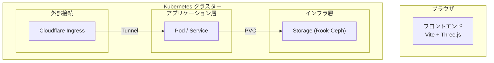

# システム実装仕様書 (v1.0)

本ドキュメントは、k8s-3d-visualizer の現時点における実装仕様をまとめた正解ドキュメントである。

## 1. システム概要
自宅KubernetesクラスターのNode・Pod・Service・Namespaceの構成とネットワーク接続を、Three.jsによる3Dグラフィクスでリアルタイム可視化するWebアプリケーション。

## 2. アーキテクチャ
システムはフロントエンド (Vite + Three.js) とバックエンド (Node.js) で構成される。

### 全体構成図


### 空間レイアウトの階層構造
シーンを垂直方向に3つの層で構成し、役割に応じた配置を行っている。

| レイヤー | Y座標 | 主な役割 |
|---|---|---|
| **Ingress層** | 10 ~ 12 | 外部流入、ゲートウェイ、ポータル。現在はオプトアウト可能。 |
| **Workload層** | 0 | 通常のアプリケーション Pod、Service。Namespace ごとに水平に配置。 |
| **Storage層** | -3 | Rook-Ceph 等の物理ストレージ基盤。アプリケーションの「土台」として機能。 |

## 3. フロントエンド仕様

### 主要コンポーネントとインターフェース
- **SceneSetup.js**: `initScene(canvasId)` -> `{ scene, camera, renderer, controls, startLoop }`
    - 背景色: `null` (透過), Camera Pos: `(0, 6, 12)`, Target: `(0, 2, 0)`
- **GlbLoader.js**: `loadModels()` -> `{ 'pod-running': Object3D, ... }`
- **ObjectPlacer.js**: `placePocObjects(models)` -> `{ pods, services }`
- **ConnectionLine.js**: `buildConnectionLines(connections)` -> `THREE.Line[]`
    - Material: `LineBasicMaterial` (opacity: 0.35)
- **LabelRenderer.js / ObjectLabel.js**: `initLabelRenderer(container)`, `attachLabel(object, text, kind)`
- **HoverHandler.js**: `setupHoverHandler({ renderer, camera, objects, onEnter, onLeave })`
- **LogoRenderer.js**: 右上の 3D ロゴの独立描画。

### インタラクション
- **Namespace フォーカス**: サイドバーで選択した Namespace のみを強調。カメラの自動追従 (`fitCamera`)。
- **ストレージパイプライン**: Pod が稼働している物理 Node を判別し、同じ Node 上の Ceph Pod へシアン色のラインを結ぶ。

## 4. バックエンド仕様

### REST API
- `GET /api/cluster`: クラスターの初期状態一括取得。
- `GET /api/pod/:ns/:name`: Pod 詳細取得。
- `GET /api/node/:name`: Node 詳細取得。

### WebSocket
- `INIT`: 接続時の全リソース送信。
- `ADDED` / `MODIFIED` / `DELETED`: Kubernetes API Watch による差分プッシュ。

## 5. 展開・接続仕様
- **接続方式**: クラスター内では In-cluster Config、ローカル開発では `~/.kube/config` を使用。
- **RBAC**: `ServiceAccount`, `ClusterRole`, `ClusterRoleBinding` による読み取り権限の付与が必要。
- **デプロイ**: `backend` (Fastify) および `frontend` (Nginx) の Docker イメージを k8s 上に展開。

---

## 付録: ディレクトリ構成
```
k8s-3d-visualizer/
├── frontend/                # Three.js Webアプリ
├── backend/                 # Node.js APIサーバー
└── k8s/                     # Kubernetesマニフェスト
```
